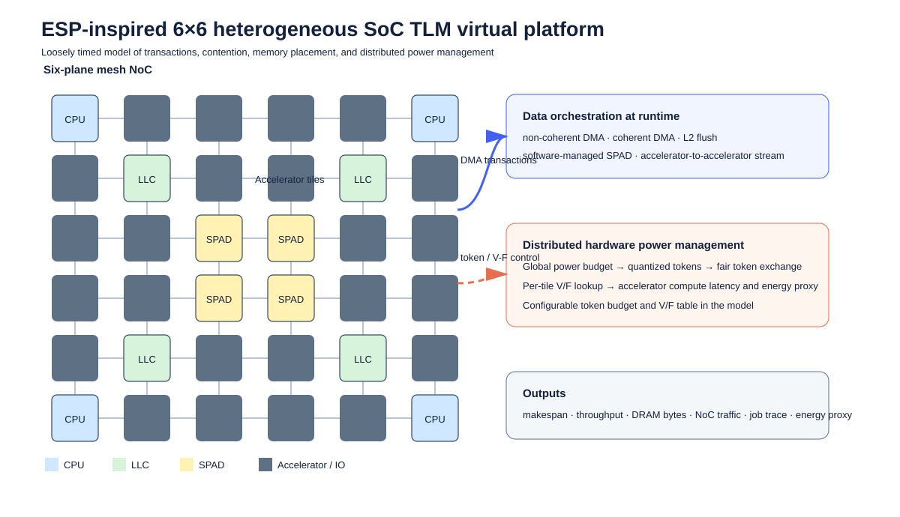
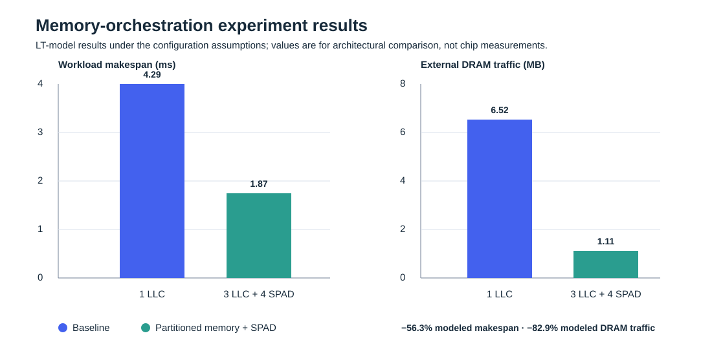

# ESP-Inspired Heterogeneous SoC Virtual Platform

An executable, transaction-level performance model of the 12 nm ISSCC 2024
heterogeneous RISC-V SoC described in *“A 12nm Linux-SMP-Capable RISC-V SoC
with 14 Accelerator Types, Distributed Hardware Power Management and Flexible
NoC-Based Data Orchestration.”*

This package includes two architectural simulation modes. The original
**loosely timed (LT)** engine is fast for broad sweeps. The new
**approximately timed (AT)** engine models a four-phase non-blocking
transaction protocol, packet/flit serialization, virtual-channel arbitration,
finite VC buffers, router stages, and asynchronous tile boundaries. Neither
mode reproduces unreleased RTL, OS drivers, or the confidential NoC protocol.





## What is modeled

| Component | Model fidelity |
| --- | --- |
| 6x6 mesh NoC / six planes | XY routing, per-link serialization queues, packet-size and hop delays |
| CPU and accelerator tiles | Transaction initiators/targets; accelerator compute latency at a selected frequency |
| LLC / DRAM / SPAD | Independent service queues, capacity checks, bandwidth and access latency |
| DMA modes | Non-coherent DMA, coherent DMA, coherent DMA + L2 flush, SPAD, and direct accelerator streaming |
| DHPM | Global quantized power tokens, fair token exchange, per-tile V/F lookup approximation |
| Workloads | Parallel accelerator jobs plus optional producer-consumer dependencies |

All baseline numeric assumptions are intentionally collected in
`configs/esp_isscc2024.json`; change them rather than modifying simulator code.

## Quick start

No external Python package is required.

```bash
cd esp_tlm_vp
python3 -m esp_tlm.run --config configs/esp_isscc2024.json --scenario baseline
python3 -m esp_tlm.run --config configs/esp_isscc2024.json --scenario llc_spad
python3 -m esp_tlm.run --config configs/esp_isscc2024.json --scenario direct_stream
python3 -m esp_tlm.run --config configs/esp_isscc2024.json --scenario dhpm_5accel
python3 -m esp_tlm.at_run --config configs/esp_isscc2024.json --scenario dhpm_5accel
python3 -m unittest discover -s tests -v
```

Each run writes a JSON report and CSV job trace to `results/` (or use
`--out-dir`). The report contains latency, throughput, NoC congestion proxy,
DRAM traffic, energy estimate, and an explicit assumption ledger.

Run every supplied experiment:

```bash
python3 experiments/run_all.py
python3 experiments/run_at_all.py
```

The two SVG visuals are standalone and can be inserted directly into a README,
report, or slide deck. Their source is in `visuals/`.

## Mapping to the paper

The `baseline` scenario approximates one LLC tile; `llc_spad` enables three
LLC tiles and four SPAD tiles; `direct_stream` chains audio-decode to FFT
without an LLC round trip. The experiments are designed to reproduce the
**direction** of the paper's Fig. 14.5.5 observations - reduced congestion,
better throughput with more memory partitions, and streaming benefit - not its
confidential exact values.

## Approximate timing model

The AT engine emits a phase trace for every MMIO, DMA and direct-streaming
transaction:

```text
BEGIN_REQ -> router/VC stages -> END_REQ -> target service -> BEGIN_RESP -> router/VC stages -> END_RESP
```

Its reports end in `_at.json`, `_at_jobs.csv`, and `_at_phases.csv`. It is an
AT performance model, not a replacement for a cycle-accurate RTL NoC.

## Extending it toward native SystemC TLM-2.0

The Python AT engine keeps the same separation as TLM-2.0: generic
transactions, initiator/target endpoints, non-blocking phases, annotated delay
and temporal decoupling. The interface contract is documented in
`docs/systemc_migration.md`. It is deliberately dependency-free so it can run
immediately; replacing the event kernel with `sc_core::sc_time` and endpoints
with `tlm_utils` sockets is the next step once a SystemC installation and
trace/firmware inputs are available.

## Important limitations

This is suitable for architecture exploration and comparative studies. Do not
use it for sign-off, exact power claims, software functional validation, or
claims that it reproduces the original chip. Calibrate service rates, V/F
tables, memory behavior, and workload traces against measurements before using
it in a publication.
